# 🚀 Tutorial Hosting Website + Membuat & Menghubungkan Database (cPanel)

Dokumen ini menjelaskan langkah demi langkah proses **upload website ke hosting**, **membuat database MySQL**, **menghubungkan database ke aplikasi**, sampai website bisa diakses secara online — lengkap dengan screenshot setiap langkah. Di bagian akhir ada juga panduan cara mengunggah foto-foto ini ke repository GitHub agar tampil di README.

---

## 📋 Daftar Isi

1. [Persiapan](#-persiapan)
2. [Langkah 1–2: Masuk ke Client Area & cPanel](#langkah-12-masuk-ke-client-area--cpanel)
3. [Langkah 3–7: Membuat Database & User Database](#langkah-37-membuat-database--user-database)
4. [Langkah 8–9: Membuat Tabel Lewat phpMyAdmin](#langkah-89-membuat-tabel-lewat-phpmyadmin)
5. [Langkah 10–13: Upload & Extract File Project](#langkah-1013-upload--extract-file-project)
6. [Langkah 14–15: Cek Website Sudah Online](#langkah-1415-cek-website-sudah-online)
7. [Menghubungkan Database ke Kode Website](#-menghubungkan-database-ke-kode-website)
8. [Cara Upload Foto ke README GitHub](#-cara-upload-foto-ke-readme-github)
9. [Catatan Keamanan](#-catatan-keamanan)

---

## ✅ Persiapan

Sebelum mulai, pastikan sudah punya:

- Akun hosting aktif (cPanel) dari penyedia hosting (contoh di tutorial ini: WideHostMedia)
- Domain yang sudah terhubung ke hosting
- File project website dalam bentuk `.zip` (misalnya `portfolio-php-mysql.zip`)
- Query SQL untuk membuat struktur tabel (jika ada)

---

## Langkah 1–2: Masuk ke Client Area & cPanel

**Langkah 1 — Buka Layanan di Client Area**

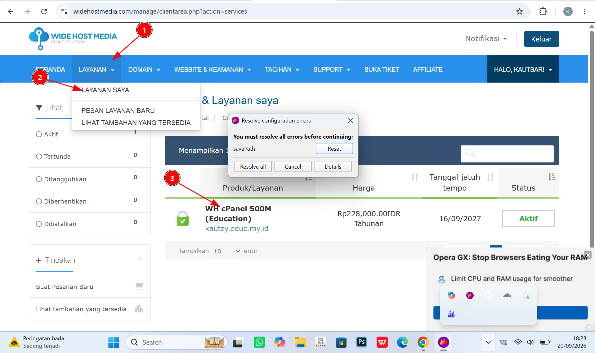

Masuk ke Client Area penyedia hosting, lalu buka menu **Layanan → Layanan Saya** untuk melihat daftar paket hosting yang aktif. Klik layanan hosting yang ingin dikelola (di sini bernama *WH cPanel 500M*).

**Langkah 2 — Masuk ke cPanel**

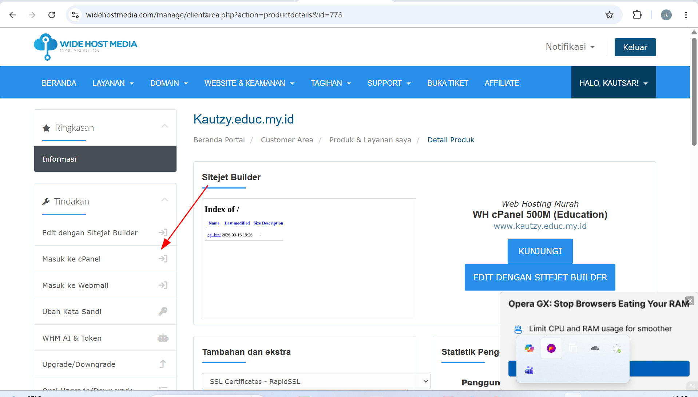

Di halaman detail produk, klik tombol/menu **"Masuk ke cPanel"** pada bagian Tindakan. Ini akan membuka dashboard cPanel milik domain tersebut di tab baru.

---

## Langkah 3–7: Membuat Database & User Database

**Langkah 3 — Buka "Manage My Databases"**

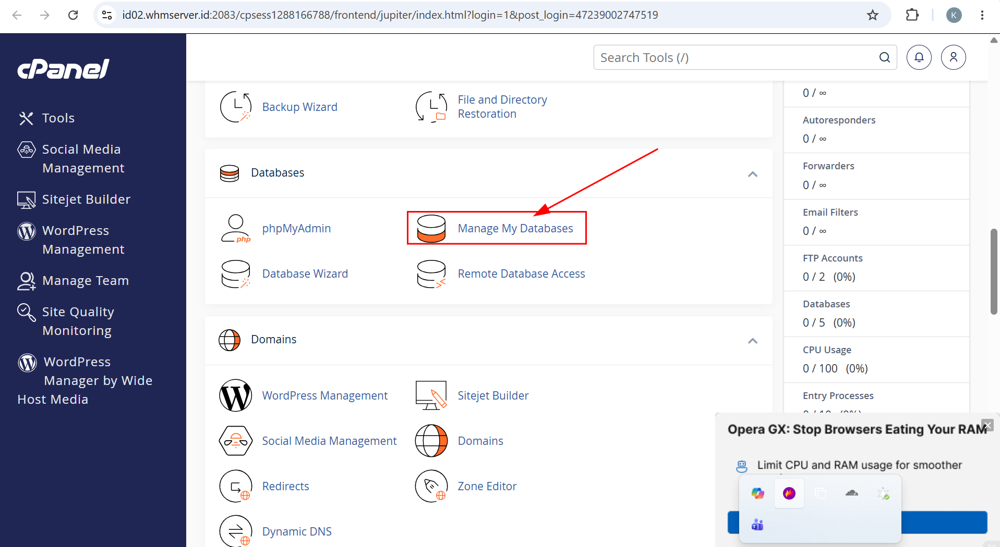

Di dashboard cPanel, scroll ke bagian **Databases**, lalu klik **Manage My Databases**.

**Langkah 4 — Membuat Database Baru**

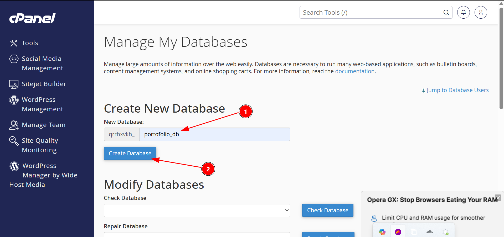

Pada bagian **Create New Database**, isi nama database (contoh: `portofolio_db`), lalu klik **Create Database**. cPanel otomatis menambahkan prefix akun di depan nama database (misalnya `qrrhxvkh_portofolio_db`) — prefix ini nanti dipakai saat menghubungkan database ke kode program.

**Langkah 5 — Membuat User Database**

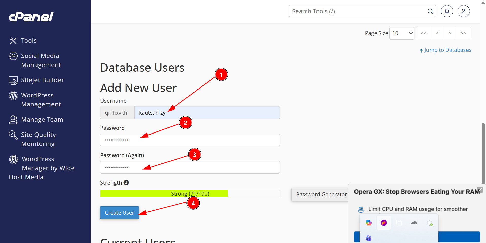

Scroll ke bagian **Add New User**, isi **Username** dan **Password** yang kuat, lalu klik **Create User**. User inilah yang nanti dipakai aplikasi untuk login ke database (bukan login cPanel).

**Langkah 6 — Menghubungkan User ke Database**

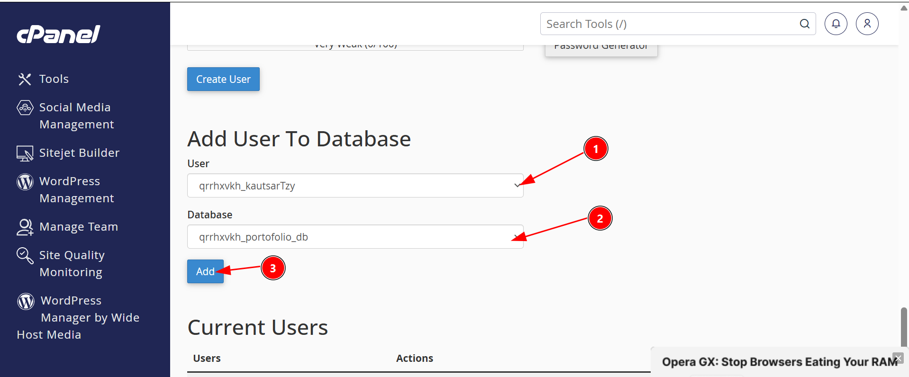

Pada bagian **Add User To Database**, pilih **User** dan **Database** yang baru dibuat, lalu klik **Add**. Ini menautkan user tersebut agar bisa mengakses database yang dipilih.

**Langkah 7 — Memberi Hak Akses (Privileges)**

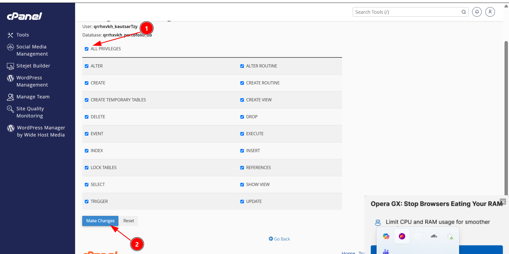

Centang **ALL PRIVILEGES** agar user memiliki semua hak akses (SELECT, INSERT, UPDATE, DELETE, dll) ke database tersebut, lalu klik **Make Changes**.

> Tanpa langkah ini, aplikasi tidak akan bisa membaca/menulis data ke database meskipun database dan user sudah ada.

---

## Langkah 8–9: Membuat Tabel Lewat phpMyAdmin

**Langkah 8 — Membuka phpMyAdmin**

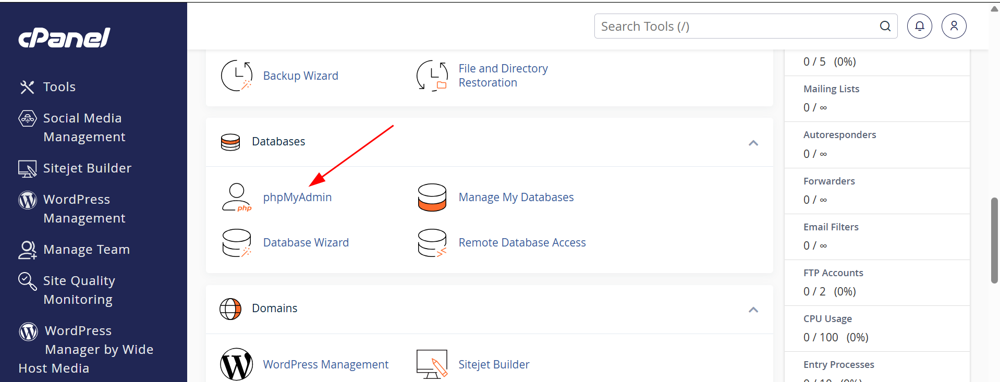

Kembali ke dashboard cPanel, pada bagian **Databases** klik **phpMyAdmin** untuk mengelola isi database secara visual.

**Langkah 9 — Menjalankan Query SQL untuk Membuat Tabel**

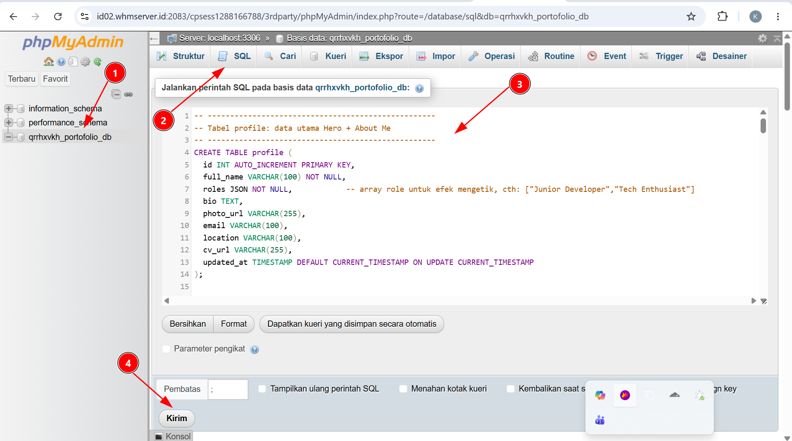

1. Pilih database yang sesuai di sidebar kiri.
2. Buka tab **SQL**.
3. Tempelkan (paste) query `CREATE TABLE` untuk membuat struktur tabel yang dibutuhkan aplikasi (contoh: tabel `profile` dengan kolom `id`, `full_name`, `roles`, `bio`, `photo_url`, dll).
4. Klik **Kirim/Go** untuk menjalankan query.

Jika berhasil, tabel baru akan langsung muncul di sidebar kiri di bawah nama database.

---

## Langkah 10–13: Upload & Extract File Project

**Langkah 10 — Membuka File Manager**

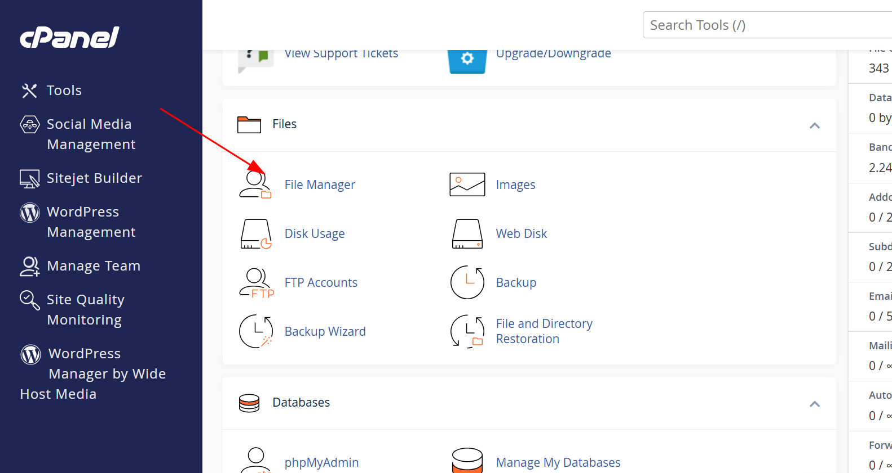

Dari dashboard cPanel, buka bagian **Files → File Manager**.

**Langkah 11 — Masuk ke Folder public_html & Klik Upload**

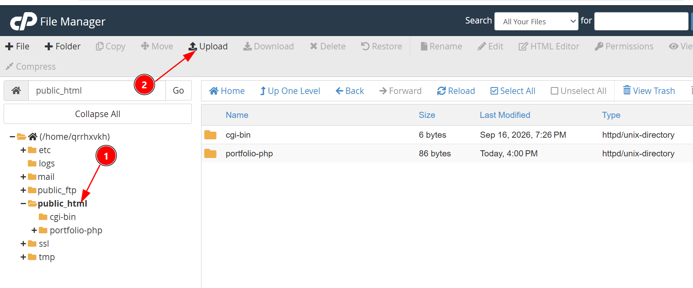

Masuk ke folder **public_html** (folder utama tempat file website harus diletakkan), lalu klik tombol **Upload** di toolbar atas.

**Langkah 12 — Upload File ZIP Project**

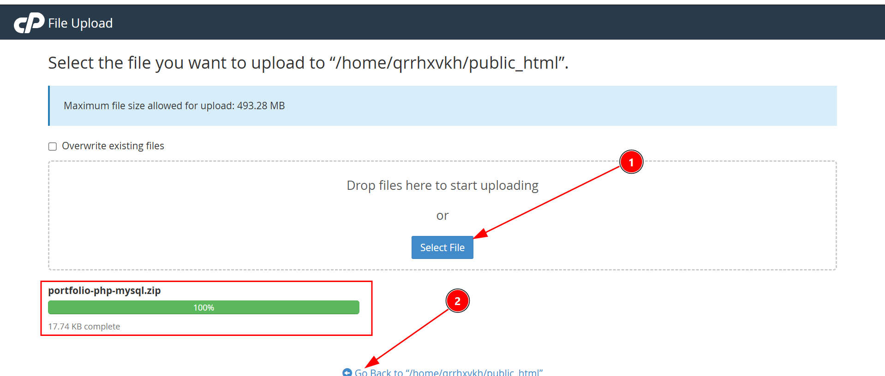

Klik **Select File**, pilih file `.zip` project (misalnya `portfolio-php-mysql.zip`), tunggu progress upload sampai 100%, lalu klik link untuk kembali ke `public_html`.

**Langkah 13 — Extract File ZIP**

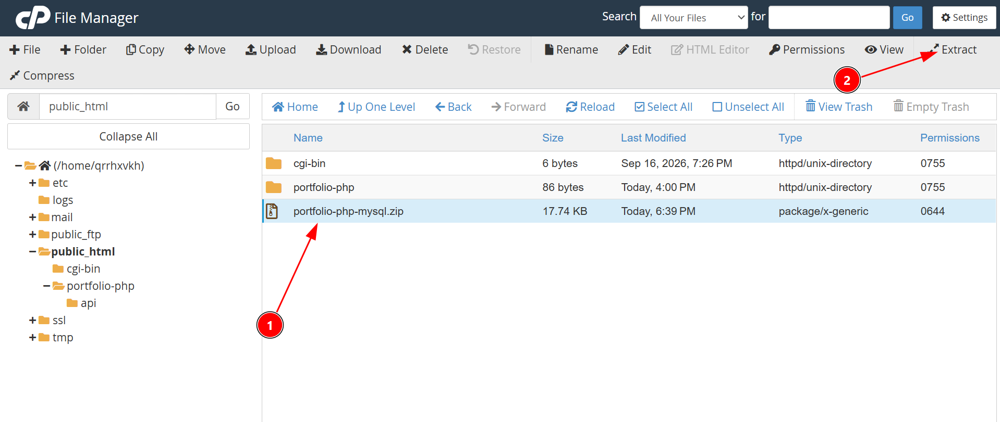

Klik file `.zip` yang baru diupload untuk memilihnya, lalu klik **Extract** di toolbar. Setelah proses selesai, isi zip akan terekstrak menjadi folder project (contoh: `portfolio-php`).

---

## Langkah 14–15: Cek Website Sudah Online

**Langkah 14 — Membuka Domain di Browser**

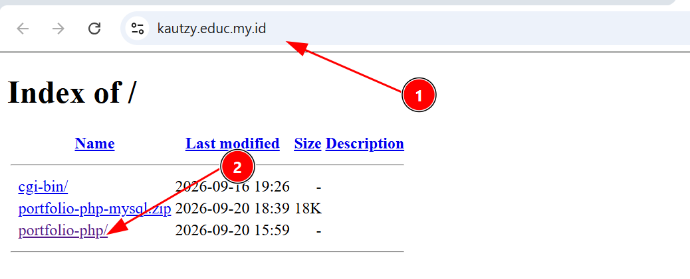

Buka domain di browser. Jika file masih dalam bentuk folder biasa (belum dipindah ke root `public_html`), akan muncul tampilan **Index of /** yang menampilkan folder-folder yang ada. Klik folder project untuk membukanya.

**Langkah 15 — Website Berhasil Tampil**

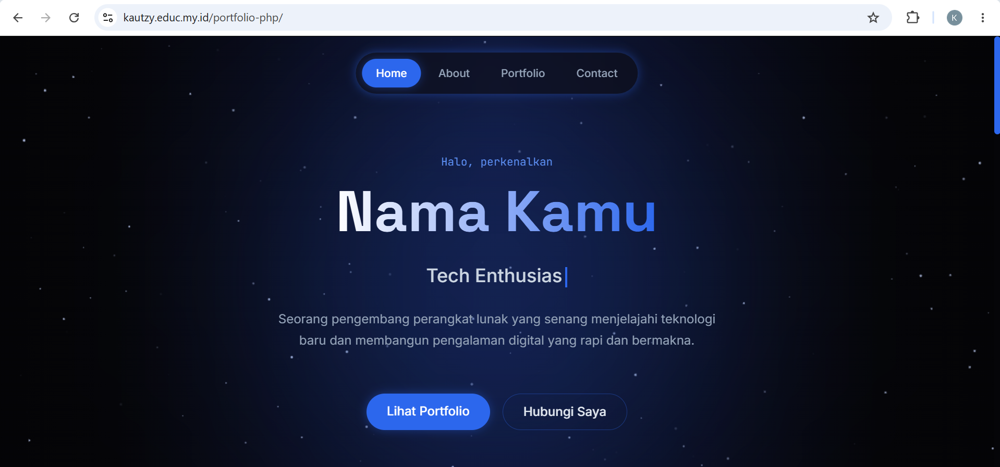

Website sudah bisa diakses secara online melalui `namadomain.com/nama-folder-project/`. Sampai di sini, proses hosting file website sudah selesai.

---

## 🔗 Menghubungkan Database ke Kode Website

Setelah database, user, tabel, dan file website sudah siap, langkah terakhir adalah menghubungkan kode PHP ke database MySQL tersebut. Biasanya project PHP punya file konfigurasi koneksi (contoh: `config.php`, `db.php`, atau `koneksi.php`). Isi bagian kredensialnya dengan data yang sudah dibuat di Langkah 4–7:

```php
<?php
$host    = "localhost";                    // biasanya tetap "localhost" di cPanel
$dbname  = "qrrhxvkh_portofolio_db";       // nama database lengkap dgn prefix cPanel
$dbuser  = "qrrhxvkh_kautsarTzy";          // username lengkap dgn prefix cPanel
$dbpass  = "PASSWORD_DATABASE_ANDA";       // password yang dibuat di Langkah 5

$koneksi = new mysqli($host, $dbuser, $dbpass, $dbname);

if ($koneksi->connect_error) {
    die("Koneksi database gagal: " . $koneksi->connect_error);
}
?>
```

Poin penting:

- Nama database dan username di cPanel **selalu memakai prefix** (biasanya nama akun cPanel), jadi jangan lupa sertakan prefix tersebut di file konfigurasi.
- Setelah file konfigurasi diedit lewat **File Manager → Edit**, simpan (Save Changes), lalu refresh website untuk memastikan koneksi berhasil (tidak muncul pesan error koneksi).
- Jika project memakai file `.env`, sesuaikan variabel `DB_HOST`, `DB_DATABASE`, `DB_USERNAME`, `DB_PASSWORD` dengan cara yang sama.

---

## 🖼️ Cara Upload Foto ke README GitHub

Agar gambar-gambar tutorial ini ikut tampil saat README dibuka di GitHub, ikuti langkah berikut:

1. **Buat folder khusus gambar** di dalam repository, misalnya `screenshots/`, lalu simpan semua file gambar di sana (`1.png`, `2.png`, dst). Struktur repo jadi seperti ini:

   ```
   nama-repo/
   ├── README.md
   └── screenshots/
       ├── 1.png
       ├── 2.png
       ├── ...
       └── 15.png
   ```

2. **Panggil gambar di README** memakai sintaks Markdown berikut (path relatif terhadap README.md):

   ```markdown
   
   ```

3. **Upload lewat GitHub Desktop / Git CLI** (disarankan untuk banyak file sekaligus):

   ```bash
   git add screenshots/ README.md
   git commit -m "Tambah tutorial hosting dan database beserta screenshot"
   git push origin main
   ```

   Atau lewat **web GitHub**: buka repo → klik **Add file → Upload files** → drag semua gambar ke folder `screenshots` → klik **Commit changes**.

4. **Cek hasilnya** dengan membuka file README.md di halaman repo GitHub — semua gambar seharusnya tampil otomatis sesuai urutan yang ditulis di Markdown.

> Tips: gunakan nama file yang deskriptif (misalnya `01-login-clientarea.png`) supaya lebih mudah dikelola saat foto makin banyak.

---

## 🔒 Catatan Keamanan

- **Jangan pernah** menaruh password database asli di README atau file yang diunggah ke repository publik. Gunakan file `.env` yang dimasukkan ke `.gitignore`, atau ganti dengan placeholder seperti pada contoh kode di atas.
- Blur atau crop bagian yang menampilkan password, token, atau data sensitif sebelum screenshot diupload ke repository publik.
- Jika repository bersifat publik, sebaiknya ganti password database dan user cPanel setelah tutorial ini selesai dibuat, untuk jaga-jaga jika ada informasi yang tidak sengaja ikut terekspos di screenshot.
