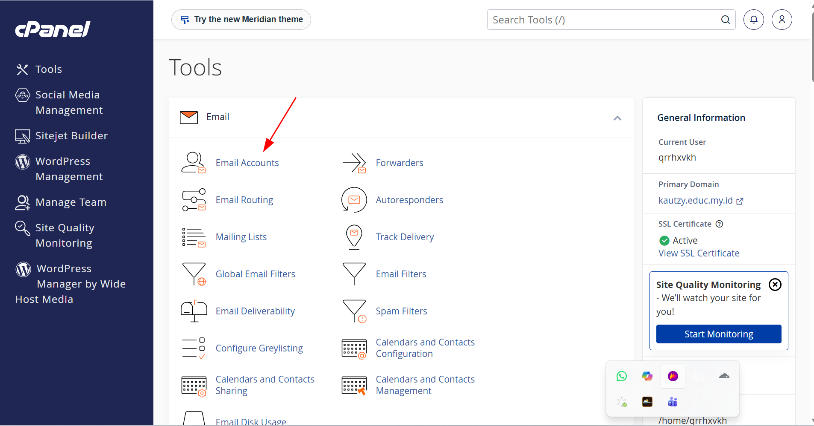
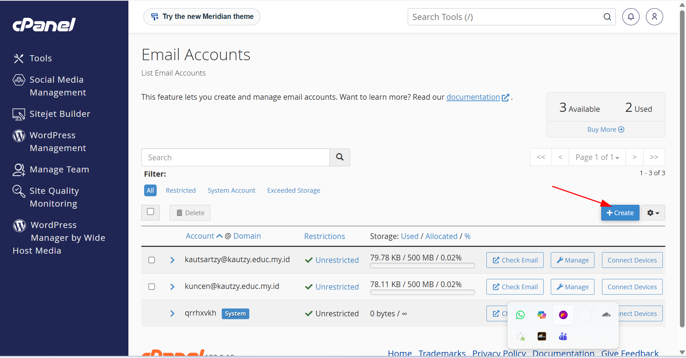
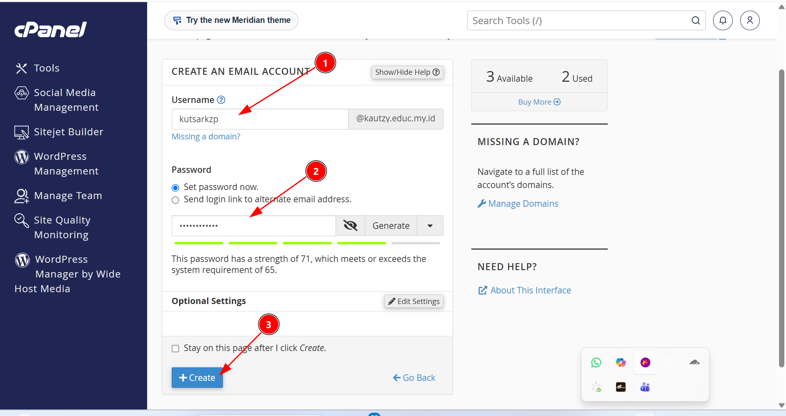
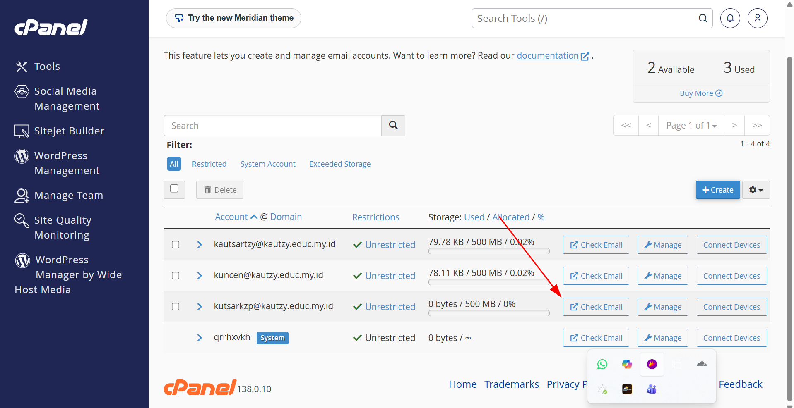
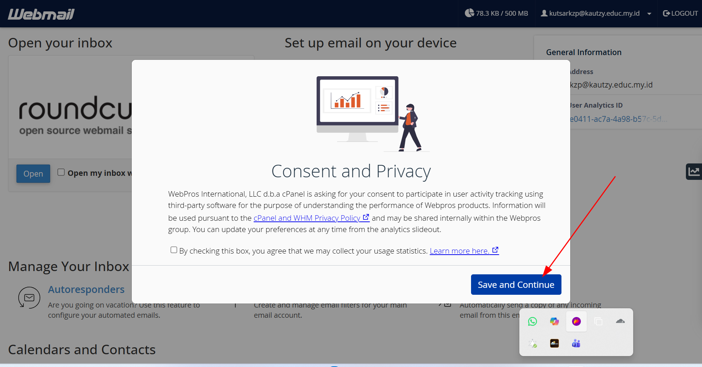
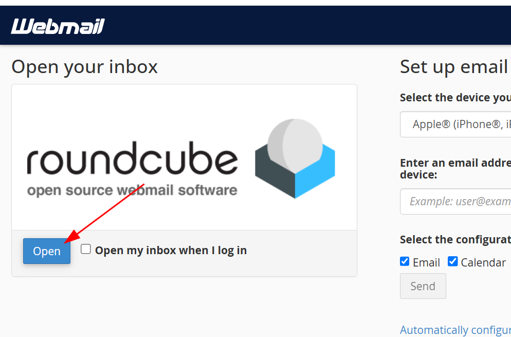
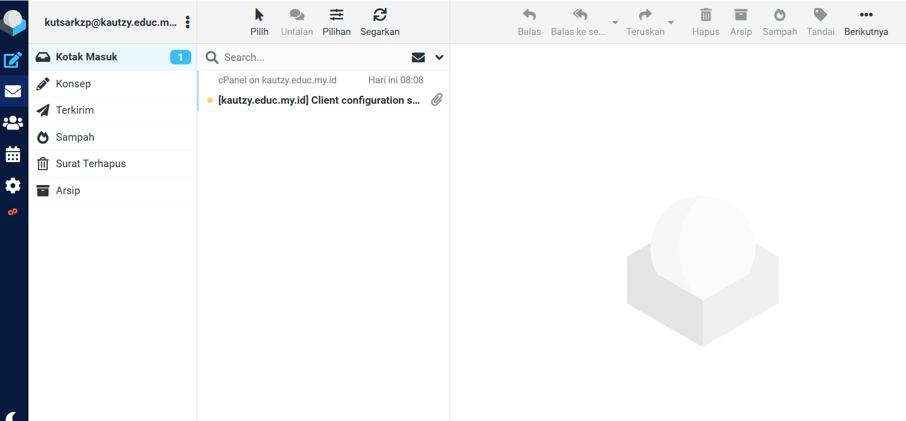

# 📧 Laporan Praktik: Membuat Email di cPanel

Repositori ini berisi dokumentasi langkah demi langkah pembuatan akun email baru melalui **cPanel**, mulai dari pembuatan akun hingga mengakses inbox lewat **Webmail (Roundcube)**.

## 📝 Deskripsi

Email merupakan salah satu layanan penting yang disediakan oleh hosting untuk mendukung komunikasi profesional menggunakan domain sendiri (contoh: `nama@namadomain.com`). Laporan ini mendokumentasikan proses pembuatan akun email baru menggunakan fitur **Email Accounts** pada cPanel.

## 🎯 Tujuan

- Memahami cara mengakses fitur **Email Accounts** di cPanel.
- Membuat akun email baru beserta konfigurasi username dan password.
- Mengakses email yang telah dibuat melalui Webmail.
- Melakukan pengecekan inbox untuk memastikan email berhasil dibuat.

## 🛠️ Alat dan Bahan

- Akses ke **cPanel** hosting
- Domain yang sudah aktif
- Browser (Chrome/Firefox/Edge, dll.)
  
> ⚠️ Saat upload ke GitHub, pastikan folder gambar diberi nama **`email`** (bukan `images`) agar semua gambar di README ini tampil dengan benar, karena path yang digunakan adalah `email/nama-file.png`.

## 🚀 Langkah-Langkah

### 1. Membuka Menu Email Accounts
Masuk ke cPanel, lalu pada bagian **Tools > Email**, klik menu **Email Accounts**.

### 2. Membuka Form Pembuatan Akun Email
Pada halaman **Email Accounts**, klik tombol **+ Create** untuk membuat akun email baru.

### 3. Mengisi Data Akun Email
Isi form **Create an Email Account**:
1. Masukkan **Username** untuk email (contoh: `kutsarkzp`).
2. Atur **Password** — bisa diketik manual atau menggunakan tombol **Generate** untuk membuat password otomatis.
3. Klik tombol **+ Create** untuk menyimpan akun email.

### 4. Verifikasi Akun Email Berhasil Dibuat
Setelah dibuat, akun email baru akan muncul di daftar **Email Accounts**. Klik **Check Email** untuk mengakses inbox akun tersebut.

### 5. Menyetujui Consent and Privacy
Saat pertama kali membuka Webmail, akan muncul jendela **Consent and Privacy**. Klik **Save and Continue** untuk melanjutkan.

### 6. Membuka Aplikasi Webmail (Roundcube)
Pilih aplikasi webmail **Roundcube**, lalu klik tombol **Open** untuk membuka inbox.

### 7. Mengecek Kotak Masuk (Inbox)
Email berhasil dibuat dan sudah bisa digunakan. Terlihat notifikasi otomatis dari cPanel (*Client configuration*) masuk ke **Kotak Masuk**.

## ✅ Kesimpulan

Pembuatan akun email melalui cPanel dapat dilakukan dengan mudah melalui menu **Email Accounts**. Setelah akun dibuat, email dapat langsung diakses melalui **Webmail** tanpa perlu konfigurasi tambahan, dan siap digunakan untuk mengirim maupun menerima pesan.

---
📌 *Laporan ini dibuat sebagai dokumentasi praktik pembuatan email menggunakan cPanel.*
